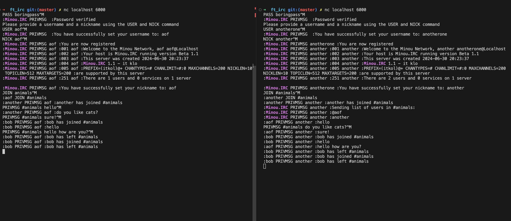

# IRC server
This project is about creating our own IRC server in c++ that follows the [IRC protocol](https://modern.ircdocs.horse/) and that is compatible with LimeChat client. IRC (Internet Relay Chat) is a real-time messaging protocol that enables users to communicate in text-based chat rooms (channels) or via private messages. 



### How to use it

1. Clone the repository.
2. Use ``make`` to create the ``ircserv`` executable.

Simply run it with :

```
./ircserv <PORT> <password>
```
Connect to the server with nc :

```
nc localhost <PORT>
```
You can also use LimeChat client to connect!
